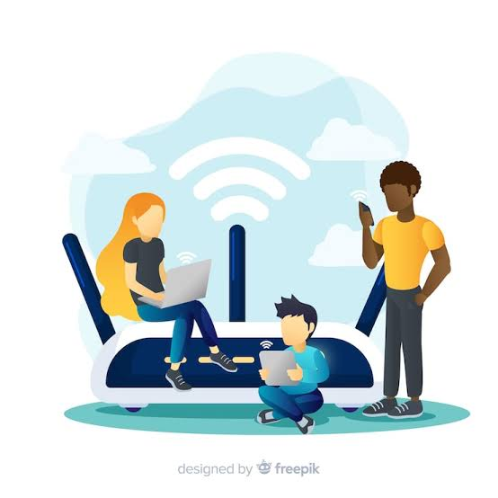

# Welcome to my Blog!

## That Public Wi-Fi May Not Be What It Seems

### Think twice before connecting to public Wi-Fi. A familiar network name doesn’t necessarily mean it’s legitimate.
Imagine you’re at an airport, hotel, coffee shop, or even on a flight. You open your Wi-Fi settings and see a network name that looks exactly like the one you expect. You connect without giving it much thought.

But what if that network was created by an attacker?

#### A Recent Reminder: The “Evil Twin” Wi-Fi Attack

A recent incident aboard a Delta flight from Las Vegas to Atlanta brought attention to this very real cybersecurity risk.
According to reports, an unauthorized Wi-Fi network appeared onboard that looked like a legitimate Delta network. The fake hotspot reportedly directed users to a phishing page designed to collect personal login credentials.
This type of attack is commonly known as an “Evil Twin” attack.
An attacker creates a Wi-Fi network that imitates a legitimate one—sometimes using a nearly identical or convincing network name. If you connect, the attacker may be able to redirect you to fraudulent websites or attempt to capture information such as usernames and passwords.

### How Can You Protect Yourself?
#### Verify before you connect.
Don’t assume a Wi-Fi network is legitimate simply because its name looks right. At hotels, airports, conferences, or other public locations, confirm the official network name when possible.
#### Be suspicious of unexpected login pages.
If a Wi-Fi network suddenly asks you to sign in with your Google, Microsoft, work, or other account credentials, stop and make sure the request is legitimate.
#### Avoid public Wi-Fi when possible.
A cellular connection or trusted personal hotspot can be a safer choice than an unfamiliar public network.
#### Turn off automatic Wi-Fi connections.
Configure your devices so they don’t automatically join available or previously recognized networks.
#### If something doesn’t look right, don’t connect.
A slightly different network name, an unexpected login prompt, or unusual behavior after connecting can all be warning signs.
#### The Bottom Line
Cybercriminals don’t always need sophisticated malware to steal information. Sometimes, all they need is for you to connect to the wrong Wi-Fi network.
Before you connect, take a few seconds to verify the network. A familiar name alone isn’t proof that you can trust it.

##### Read about the recent incident: [Crowd Suspected in fake-hotspot attack](https://arstechnica.com/information-technology/2026/08/def-con-crowd-suspected-in-fake-hotspot-attack-on-delta-flight/?utm_source=www.vulnu.com&utm_medium=newsletter&utm_campaign=vulnerable-u-181&_bhlid=8a11efc2e9623917427a9048e7b91aaede61ec1d).
